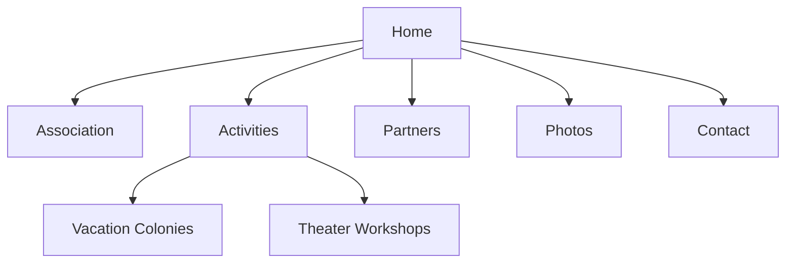
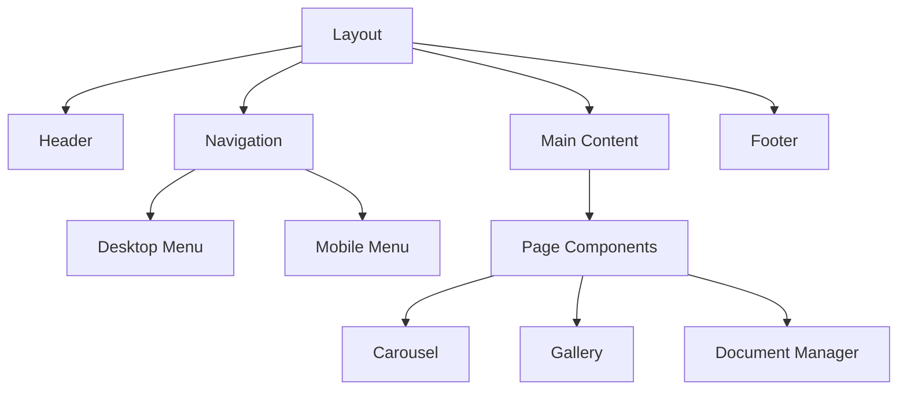

# LEDM Website Implementation Plan

## Overview
This document outlines the complete implementation plan for Les Enfants des Mousquetaires' static website, following the SPARC methodology. The plan is derived from requirements specified in [`docs/website-plan.md`](docs/website-plan.md).

## 1. Specification (Phase 1)

### 1.1 Project Analysis
- **Goals**
  - Static responsive website for the association
  - Showcase inclusive vacation colonies
  - Provide easy access to information for families
  - Promote association's family-oriented identity

- **Target Audience**
  - Primary: Parents seeking vacation options
  - Secondary: Theater workshop participants
  - Tertiary: Partner organizations

### 1.2 Technical Requirements
- Static site (HTML/CSS/JavaScript)
- Responsive design (3 breakpoints)
- No backend requirements
- Asset optimization for performance

### 1.3 Content Structure


## 2. Pseudocode (Phase 2)

### 2.1 Component Architecture


### 2.2 Key Functionalities
```javascript
// Navigation System
class Navigation {
  - initializeResponsiveMenu()
  - handleMobileToggle()
  - setupDropdowns()
}

// Gallery System
class Gallery {
  - initializeLightbox()
  - setupFilters()
  - handleImageLoading()
}

// Document Manager
class DocumentManager {
  - organizeByCatetory()
  - setupDownloads()
  - filterDocuments()
}
```

## 3. Architecture (Phase 3)

### 3.1 File Structure Implementation
```
ledm-website/
├── index.html                 # Entry point
├── assets/                    # Static resources
├── pages/                     # Content pages
├── components/                # Reusable components
└── styles/                    # CSS architecture
```

### 3.2 Technical Stack
- HTML5 semantic markup
- CSS3 with custom properties
- Vanilla JavaScript modules
- External libraries:
  - Lightbox.js (gallery)
  - Swiper.js (carousels)

### 3.3 Development Standards
- BEM methodology for CSS
- JavaScript modules pattern
- Mobile-first responsive approach
- Progressive enhancement

## 4. Refinement (Phase 4)

### 4.1 Performance Optimization
- Image compression workflow
- CSS/JS minification
- Lazy loading implementation
- Cache strategy

### 4.2 Responsive Adaptations
```css
/* Breakpoint Strategy */
Mobile: max-width: 767px
Tablet: 768px - 1023px
Desktop: min-width: 1024px
```

### 4.3 Testing Protocol
- Cross-browser compatibility
- Responsive behavior
- Performance metrics
- Accessibility compliance

## 5. Completion (Phase 5)

### 5.1 Deployment Strategy
1. Asset optimization
2. Final testing
3. Documentation completion
4. Static hosting setup

### 5.2 Documentation Requirements
- Setup instructions
- Content update guide
- Performance benchmarks
- Maintenance procedures

## Task Breakdown by Specialist Mode

### 🏗️ Architect Mode Tasks
1. Initial project structure setup
2. Component architecture design
3. Technical standards documentation
4. Integration oversight

### 💻 Code Mode Tasks
1. Core HTML structure implementation
2. JavaScript functionality development
3. Component integration
4. Performance optimization

### 🎨 Designer Mode Tasks
1. CSS architecture implementation
2. Responsive design development
3. Animation implementation
4. Visual component styling

### 📘 Researcher Mode Tasks
1. Best practices verification
2. Library compatibility research
3. Performance optimization techniques
4. Accessibility requirements

### ✍️ Documentation Writer Mode Tasks
1. Technical documentation
2. Maintenance guides
3. Content update procedures
4. Setup instructions

## Implementation Schedule

### Phase 1: Project Setup (Days 1-2)
- [ ] Project structure creation
- [ ] Development environment setup
- [ ] Base component architecture

### Phase 2: Core Development (Days 3-5)
- [ ] HTML structure implementation
- [ ] Basic styling setup
- [ ] Navigation system

### Phase 3: Feature Implementation (Days 6-10)
- [ ] Gallery system
- [ ] Document manager
- [ ] Contact forms
- [ ] Responsive navigation

### Phase 4: Styling & Refinement (Days 11-13)
- [ ] Complete styling
- [ ] Responsive adaptations
- [ ] Animation implementation
- [ ] Performance optimization

### Phase 5: Testing & Deployment (Days 14-15)
- [ ] Cross-browser testing
- [ ] Performance testing
- [ ] Documentation completion
- [ ] Deployment preparation

## Success Criteria
1. All pages responsive and functional
2. Performance scores above 90
3. Cross-browser compatibility
4. Accessibility compliance
5. Complete documentation

## Risk Mitigation
1. Regular progress reviews
2. Component-based development
3. Progressive enhancement
4. Regular performance monitoring

This plan serves as the master document for implementing the Les Enfants des Mousquetaires website. Each specialist mode will use this as a reference for their specific tasks while maintaining alignment with the overall project goals.