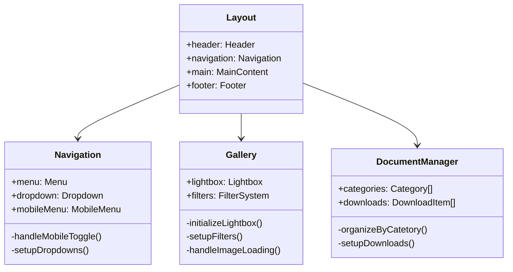
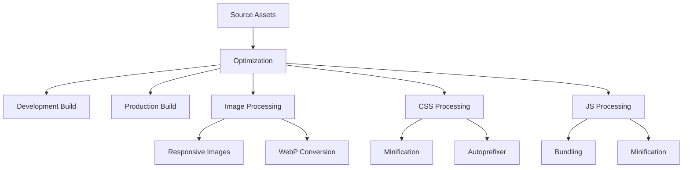

# Technical Architecture - Les Enfants des Mousquetaires Website

## 1. System Overview

### 1.1 Architecture Principles
- Static-first architecture
- Component-based structure
- Progressive enhancement
- Mobile-first responsive design
- Performance optimization by default

### 1.2 Technical Stack
- **Core Technologies**
  - HTML5 (Semantic markup)
  - CSS3 (Custom properties, Flexbox/Grid)
  - JavaScript ES6+ (Vanilla modules)
- **External Libraries**
  - Lightbox.js: Image gallery management
  - Swiper.js: Touch-enabled carousels

## 2. Directory Structure

```plaintext
ledm-website/
├── src/                      # Source code
│   ├── assets/              # Static assets
│   │   ├── images/         # Optimized images
│   │   │   ├── content/   # Content images
│   │   │   └── layout/    # UI/layout images
│   │   ├── fonts/         # Web fonts
│   │   └── documents/     # Downloadable files
│   ├── styles/            # CSS architecture
│   │   ├── base/         # Reset, typography, root vars
│   │   ├── components/   # Component styles
│   │   ├── layouts/      # Layout styles
│   │   ├── pages/        # Page-specific styles
│   │   └── main.css      # Main stylesheet
│   ├── scripts/           # JavaScript modules
│   │   ├── components/   # Component logic
│   │   ├── utils/        # Utility functions
│   │   └── main.js       # Main entry point
│   ├── components/        # HTML components
│   │   ├── layout/       # Layout components
│   │   └── ui/           # UI components
│   └── pages/            # Page templates
├── dist/                  # Production build
└── config/               # Build configuration
```

## 3. Component Architecture

### 3.1 Core Components



### 3.2 Component Specifications

#### Layout Components
- **Header**
  - Logo integration
  - Responsive navigation toggle
  - Contact information display
- **Navigation**
  - Desktop/mobile menu systems
  - Dropdown functionality
  - Current page indication
- **Footer**
  - Contact information
  - Social media links
  - Legal notices

#### Feature Components
- **Gallery System**
  - Lightbox integration
  - Category filtering
  - Lazy loading
  - Touch navigation
- **Document Manager**
  - Category organization
  - Download tracking
  - Filter system

## 4. Style Architecture

### 4.1 CSS Organization
```plaintext
styles/
├── base/
│   ├── _reset.css
│   ├── _typography.css
│   ├── _variables.css
│   └── _animations.css
├── components/
│   ├── _navigation.css
│   ├── _gallery.css
│   └── _document-manager.css
├── layouts/
│   ├── _grid.css
│   └── _flex.css
└── main.css
```

### 4.2 CSS Methodology
- BEM (Block Element Modifier) naming
- CSS Custom Properties for theming
- Mobile-first media queries
- CSS Grid for layouts
- Flexbox for components

### 4.3 Design Tokens
```css
:root {
  /* Colors */
  --color-primary: #FFB5A7;
  --color-secondary: #A8E6CF;
  --color-accent: #FDF5BF;
  --color-text: #3D405B;
  --color-background: #F8EDEB;

  /* Typography */
  --font-primary: 'Open Sans', sans-serif;
  --font-secondary: 'Montserrat', sans-serif;

  /* Spacing */
  --space-unit: 0.25rem;
  --space-xs: calc(var(--space-unit) * 2);
  --space-sm: calc(var(--space-unit) * 4);
  --space-md: calc(var(--space-unit) * 6);
  --space-lg: calc(var(--space-unit) * 8);
  --space-xl: calc(var(--space-unit) * 12);

  /* Breakpoints */
  --breakpoint-mobile: 767px;
  --breakpoint-tablet: 1023px;
  --breakpoint-desktop: 1024px;
}
```

## 5. JavaScript Architecture

### 5.1 Module Organization
```plaintext
scripts/
├── components/
│   ├── Navigation.js
│   ├── Gallery.js
│   └── DocumentManager.js
├── utils/
│   ├── lazy-loading.js
│   ├── analytics.js
│   └── helpers.js
└── main.js
```

### 5.2 Implementation Patterns
- ES6 Modules
- Event delegation
- Factory functions
- Pub/Sub for component communication

## 6. Performance Optimization

### 6.1 Asset Pipeline


### 6.2 Optimization Strategies
- Image optimization workflow
- CSS/JS minification
- Lazy loading implementation
- Resource hints
- Cache strategy

## 7. Development Standards

### 7.1 Coding Conventions
- Semantic HTML5 elements
- BEM CSS methodology
- JavaScript ES6+ features
- Descriptive naming conventions
- Component-based architecture

### 7.2 Documentation Requirements
- JSDoc for JavaScript
- Component API documentation
- Style guide compliance
- Build process documentation

### 7.3 Quality Assurance
- Cross-browser testing (latest 2 versions)
- Mobile device testing
- Performance benchmarking
- Accessibility compliance (WCAG 2.1)

## 8. Build and Deployment

### 8.1 Development Workflow
1. Local development server
2. Asset optimization pipeline
3. Source maps generation
4. Hot reloading

### 8.2 Production Build
1. Asset optimization
2. Code minification
3. Cache strategy implementation
4. Performance monitoring

This technical architecture serves as the foundation for implementing the Les Enfants des Mousquetaires website, providing clear guidelines and specifications for development while ensuring maintainability and performance.